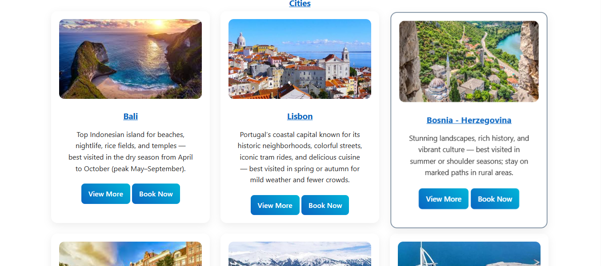
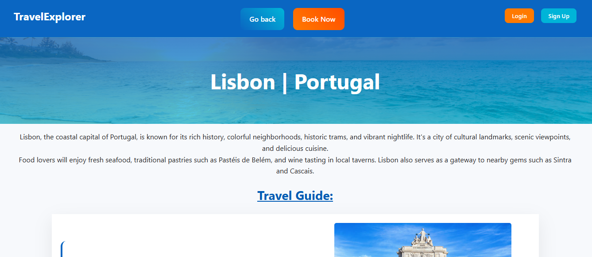
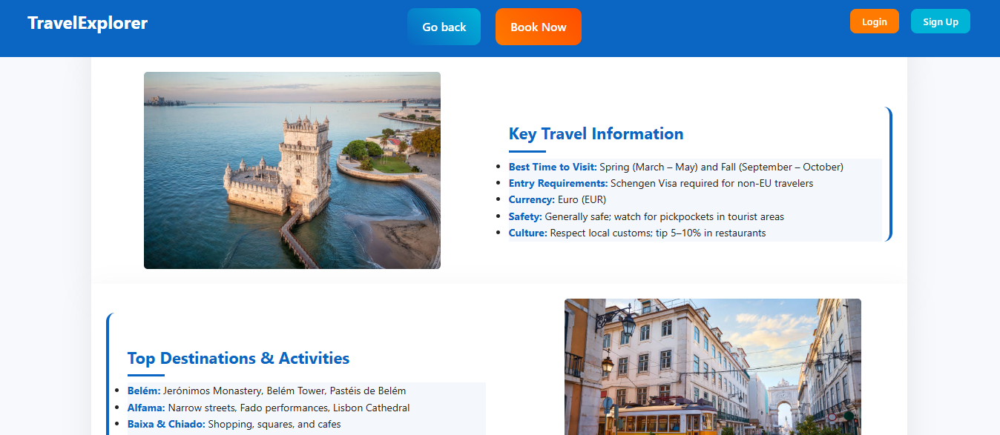
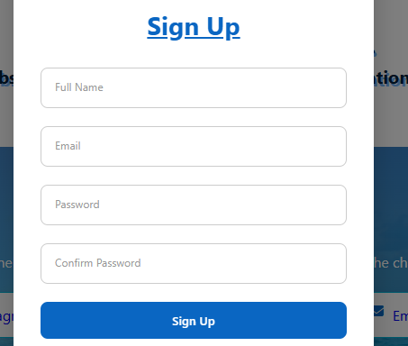
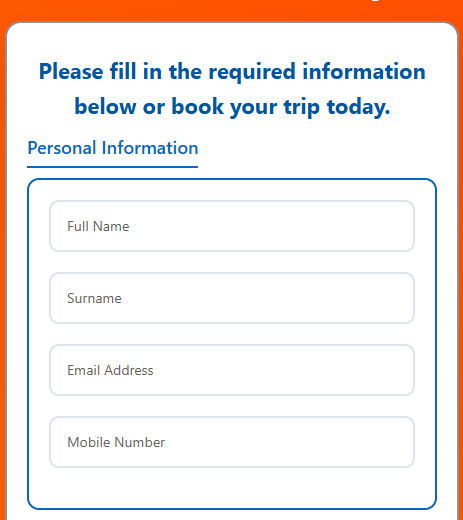
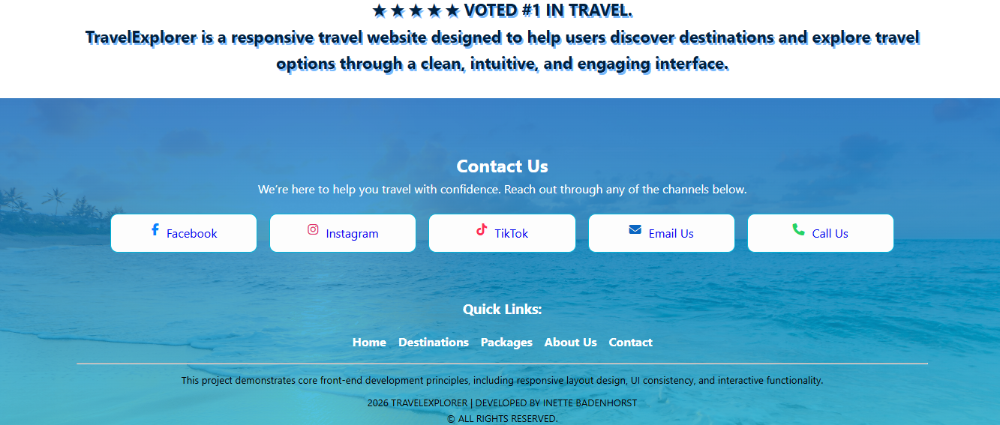

# 🌍 TravelExplorer – Travel Website


A modern, responsive travel website designed to help users explore destinations, discover curated travel packages, and plan trips with ease.

TravelExplorer focuses on **clean design, user experience, and interactive functionality**, making travel planning simple, engaging, and accessible.

---

## 📌 Overview

TravelExplorer is a front-end web project built using **HTML, CSS, and JavaScript**. It showcases:

* Popular global travel destinations
* Curated travel packages
* Special deals and offers
* Interactive booking/contact form
* Authentication UI (Login & Sign Up modal)

This project demonstrates strong **UI/UX design principles**, structured layout, and responsive web development.

---

## 🚀 Features

### 🌐 Navigation & Layout

* Responsive navigation bar with mobile menu toggle
* Clean and structured multi-section layout
* Smooth user experience across devices

### 🧭 Hero Section

* Engaging headline and call-to-action
* Travel search inputs (destination + dates)

### 💸 Deals Section

* Multiple travel deals with discounts
* Interactive “View More” dropdown functionality
* Structured itineraries and pricing

### 📦 Travel Packages

* Essential, Deluxe, and Ultimate packages
* Expandable details for each package
* Clear and persuasive content design

### 🏝️ Destinations

* Popular global destinations (Paris, Tokyo, New York, etc.)
* Destination cards with images and descriptions
* Internal linking to detailed pages

### 🌆 Cities Section

* Highlighted top travel cities
* “View More” and “Book Now” actions

### 👤 Authentication Modal

* Login and Sign-Up forms
* Clean modal UI design
* Form validation structure

### 📩 Contact Form

* Detailed travel booking form
* Personal + travel information fields
* Checkboxes, radio buttons, and dropdowns

### ⭐ Additional Features

* Social media integration
* Star rating section
* SEO optimization (meta tags + Open Graph)
* Accessible form labels and structure

---

## 🛠️ Technologies Used

* **HTML5** – Structure and semantic layout
* **CSS3** – Styling, layout, responsiveness
* **JavaScript** – Interactivity and dynamic elements
* **Font Awesome** – Icons
* **Git & GitHub** – Version control and hosting

---

## 📂 Project Structure

```
Travel Website/
│── index.html
│── styles.css
│── javascript.js
│── README
│── travel-img/
│    ├── images (destinations, icons, etc.)
├── pages/
│   ├── amsterdam.html
│   ├── bali.html
│   ├── barcelona.html
│   ├── bosnia.html
│   ├── cape-town.html
│   ├── dubai.html
│   ├── lisbon.html
│   ├── manali.html
│   ├── new-york.html
│   ├── paris.html
│   ├── sydney.html
│   └── tokyo.html
│   ├── style.css```

---

## 📷 Screenshots
  







---

## 🌍 Live Demo

👉 Add your GitHub Pages link here:

```
https://Inette289.github.io/Updated-travel-website-project
```

---

## ⚙️ How to Run Locally

1. Clone the repository:

```
git clone https://github.com/Inette289/updated-travel-website-project.git
```

2. Open the folder:

```
cd travelexplorer
```

3. Open `index.html` in your browser

---

## 🎯 Learning Objectives

This project demonstrates:

* Responsive web design
* Layout structuring with CSS
* UI/UX best practices
* JavaScript interactivity (modals, dropdowns)
* Form handling and validation
* SEO fundamentals

---

## 💡 Future Improvements

* Add backend functionality for form submission
* Integrate real travel APIs
* Improve accessibility (ARIA roles, keyboard navigation)
* Add animations and transitions
* Implement user authentication system

---

## 👩‍💻 Author

**Inette Badenhorst**
Developer

---

## 📄 License

This project is for educational and portfolio purposes.

---

## ⭐ Final Note

TravelExplorer is more than just a website — it is a **complete front-end portfolio project** that demonstrates real-world design, structure, and functionality expected in modern web development.
